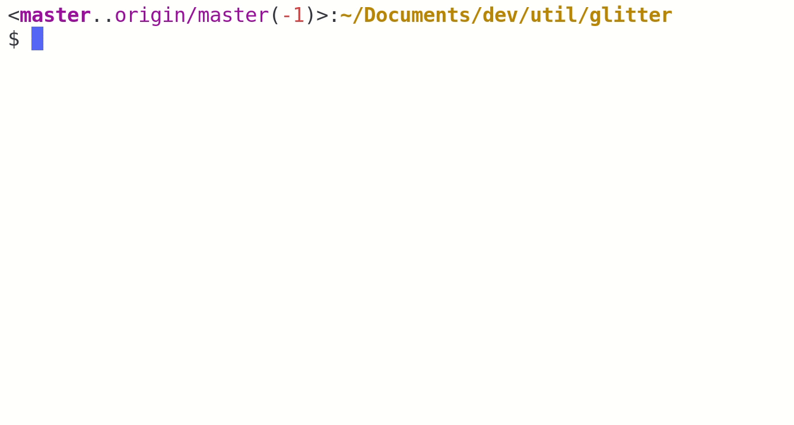

# Glitter



**A domain-specific language for printing git stats in custom formats.**

[]()[](https://travis-ci.org/glfmn/glitter)

# Installation

## Quick Start

As long as you have the rust tool-chain set up, installing is as easy as:

```
$ cargo install glit
```

You can download the rust toolchain at [rustup.rs](http://rustup.rs/).

Basic usage for `glit` is:

```
$ glit <FORMAT>
```

Learn more and get help with:

```
$ glit help
```

## Setting your shell to use `glit`

Too add a glitter format to your shell prompt if you are in a bash shell, add the following snippet to your `~/.bashrc`:

```bash
# Use environment variables to store formats if you want to be able to easily
# change them from your shell by just doing:
#
#   $ export PS1_FMT="#r;*('TODO')"

# Format to use inside of git repositories or their sub-folders
export PS1_FMT="\<#m;*(\b)#m(\B(#~('..')))\(#g(\+)#r(\-))>\[#g;*(\M\A\R\D)#r;*(\m\a\u\d)]\{#m;*;_(\h('@'))}':'#y;*('\w')'\n\$ '"

# Format to use outside of git repositories
export PS1_ELSE_FMT="#g(#*('\u')'@\h')':'#b;*('\w')'\$ '"

# Prompt command which is used to set the prompt, includes some extra useful
# functionality such as showing the last exit code
__set_prompt() {
    local EXIT="$?"
    # Capture last command exit flag first

    # Clear out prompt
    PS1=""

    # If the last command didn't exit 0, display the exit code
    [ "$EXIT" -ne "0" ] && PS1+="$EXIT "

    # identify debian chroot, if one exists
    if [ -z "${debian_chroot:-}" ] && [ -r /etc/debian_chroot ]; then
      PS1+="${debian_chroot:+($(cat /etc/debian_chroot))}"
    fi

    # Render the appropriate format depending on whether we are in a git repo
    PS1+="$(glit "$PS1_FMT" -e "$PS1_ELSE_FMT")"
}

export PROMPT_COMMAND=__set_prompt
```

Where the variable **PS1_FMT** contains your glitter format.  Here are a few examples you might want to try out on your system.

| Example `fmt`                                                                                              | Result                                                |
|:-----------------------------------------------------------------------------------------------------------|:-----------   ----------------------------------------|
| `"\<#m;*(\b)#m(\B(#~('..')))\(#g(\+)#r(\-))>\[#g;*(\M\A\R\D)#r;*(\m\a\u\d)]\{#m;*;_(\h('@'))}"`            |             |
| `"\(#m;*(\b)#g(\+)#r(\-))\[#g(\M\A\R\D)#r(\m\a\u\d)]\{#m;_(\h('@'))}':'"`                                  |            |
| `"#g;*(\b)#y(\B(#~('..')))\[#g(\+(#~('ahead ')))]\[#r(\-(#~('behind ')))]' '#g;_(\M\A\R\D)#r;_(\m\a\u\d)"` |  |

## Background

Most shells provide the ability to customize the shell prompt which appears before every command.  On my system, the default looks like:

```
gwen@tpy12:~/Documents/dev/util/glitter$
```

Its intended to provide useful information about your shell.  However, it normally does not include information about git repositories, requiring the near constant use of `git status` to understand the state of the repository.  The solution is to set a prompt command and dynamically update your shell with the information you want.  `glit` is made for precisely this purpose: you can provide a format, and glitter will interpret it, inserting the information in the format you want.

## Making your own glitter format

An example format looks like:`"\<\b\(\+\-)>\[\M\A\R\D':'\m\a\u\d]\{\h('@')}':'"` results in something that might look like `<master(+1)>[M1:D3]{@5}:` where

- `master` is the name of the current branch.
- `+1`: means we are 1 commit ahead of the remote branch
- `M1`: the number of staged modifications
- `D3`: is the number of unstaged deleted files
- `@5`: is the number of stashes

`glit` expressions also support inline format expressions to do things like making text red, or bold, or using ANSI terminal escape sequences, or setting RGB colors for your git information.

`glit` will only accept your format string if your current directory is a **git repository**.

`glit` expressions have four components:

1. Named expressions
2. Format expressions
3. Group expressions
4. Literals

### Literals

Any characters between single quotes are literals. Literals are left untouched.  For example, `'literal'` outputs `literal`.

```
$ glit "'hello world'"
$ glit "'\n\w\n\u'"
$ glit "'separate'' ''words'"
```

### Named expressions

Named expressions represent information about your git repository.

| Name  | Meaning                        | Example         |
|:------|:-------------------------------|:----------------|
| `\b`  | branch name or head commit id  | `master`        |
| `\B`  | remote name                    | `origin/master` |
| `\+`  | # of commits ahead remote      | `+1`            |
| `\-`  | # of commits behind remote     | `-1`            |
| `\m`  | # of unstaged modified files   | `M1`            |
| `\a`  | # of untracked files           | `?1`            |
| `\d`  | # of unstaged deleted files    | `D1`            |
| `\u`  | # of merge conflicts           | `U1`            |
| `\M`  | # of staged modified files     | `M1`            |
| `\A`  | # of added files               | `A1`            |
| `\R`  | # of renamed files             | `R1`            |
| `\D`  | # of staged deleted files      | `D1`            |
| `\h`  | # of stashed files             | `H1`            |

You can provide other expressions as arguments to expressions which replace the default prefix which appears before the result or file count.  For example, `\h('@')` will output `@3`
instead of `H3` if your repository has 3 stashed files.  You can provide an arbitrary number of valid expressions as a prefix to another named expression.

```
$ glit "\b"
$ glit "\b('on branch ')"
```

Expressions generally only render any output if their corresponding values aren't empty; in other words, if there are no added files, `glit` will not produce `A0` as the output of `\A`.

### Group Expressions

Glitter will surround grouped expressions with parentheses or brackets, and will print nothing if the group is empty.

| Macro       | Result                           |
|:------------|:---------------------------------|
| `\[]`       | empty                            |
| `\()`       | empty                            |
| `\<>`       | empty                            |
| `\{}`       | empty                            |
| `\{\b}`     | `{master}`                       |
| `\<\+\->`   | `<+1-1>`                         |
| `\[\M\A\R]` | `[M1A3]` where `\R` is empty     |
| `\[\r\(\a)]`| empty, when `\r`, `\a` are empty |

```
$ glit "\b\<\M>"
```

### Format Expressions

Glitter expressions support ANSI terminal formatting through the following styles:

| Format               | Meaning                     |
|:---------------------|:----------------------------|
| `#~(`...`)`          | reset                       |
| `#_(`...`)`          | underline                   |
| `#i(`...`)`          | italic text                 |
| `#*(`...`)`          | bold text                   |
| `#r(`...`)`          | red text                    |
| `#g(`...`)`          | green text                  |
| `#b(`...`)`          | blue text                   |
| `#m(`...`)`          | magenta/purple text         |
| `#y(`...`)`          | yellow text                 |
| `#w(`...`)`          | white text                  |
| `#k(`...`)`          | bright black text           |
| `#[01,02,03](`...`)` | 24 bit RGB text color       |
| `#R(`...`)`          | red background              |
| `#G(`...`)`          | green background            |
| `#B(`...`)`          | blue background             |
| `#M(`...`)`          | magenta/purple background   |
| `#Y(`...`)`          | yellow background           |
| `#W(`...`)`          | white background            |
| `#K(`...`)`          | bright black background     |
| `#{01,02,03}(`...`)` | 24 bit RGB background color |
| `#01(`...`)`         | Fixed terminal color        |

Format styles can be combined in a single expression by separating them with semicolons:

| Format         | Meaning                        |
|:---------------|:-------------------------------|
| `#w;K(`...`)`  | white text, black background   |
| `#r;*(`...`)`  | red bold text                  |
| `#42(`...`)`   | a forest greenish color        |
| `#_;*(`...`)`  | underline bold text            |

```
$ glit "#r;*('hello world')"
$ glit "#g;*(\b)"
$ glit "#[255,175,52]('orange text')"
$ glit "#G('green background')"
```

`glit` can understand and respects complicated nested styles, providing maximum flexibility.

```
$ glit "#g('green text with some '#*('bold')' green text')"
$ glit "#g;*(\b(#~('on branch ')))"
```
